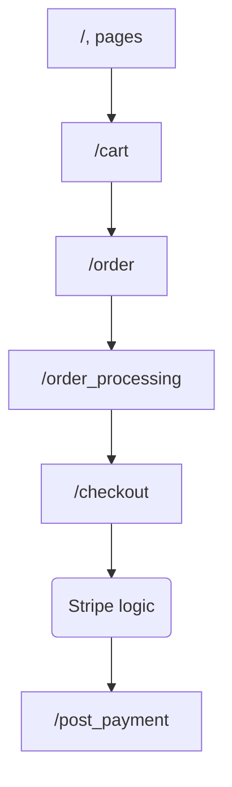

### _Sweet E-Shop, part of_

#### Functional scheme

```mermaid
graph TD;
    A["/, pages"] --> B["/cart"]
    B --> C["/order"]
    C --> D["/order_processing"]
    D --> E["/checkout"]
    E --> F("Stripe logic")
    F --> G["/post_payment"] 
```

