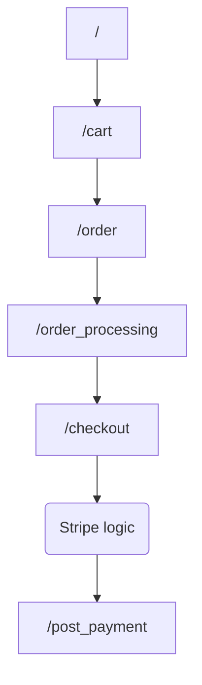

### _Sweet E-Shop (part of)_

Demo: https://test.dulcesduenas.com

This is a web-shop for the small bakery. Stack: Java, Spring Boot, Hibernate with PostgreSQL, server-side rendering with Thymeleaf,  Bootstrap+CSS for the front, JavaScript (for "reactive" page elements and logic of working with the user the "id" based on the client-side DB).

#### _Functional scheme (controllers):_

